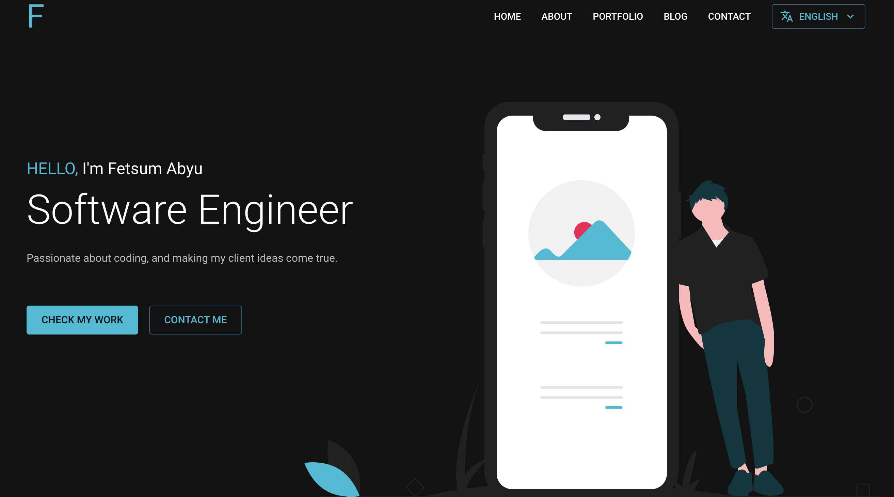

# Personal Portfolio Website

## View Project

[www.fetsumabyu.space](https://www.fetsumabyu.space)

## About the Project

This is my personal portfolio website that showcases my professional journey as a Software Engineer. The site highlights my featured projects, technical skills, leadership experiences, and personal interests. I aim to provide insights into the projects I've led, including chatbot development using OpenAI APIs and backend systems enhancements.

## Screenshots

)

## Core Dependencies

- [React](https://reactjs.org/) - A JavaScript library for building user interfaces.
- [NextJS](https://nextjs.org/) - A React framework with hybrid static & server rendering, TypeScript support, smart bundling, route pre-fetching, and more.
- [Material UI](https://mui.com/) - A React component-based design system for modern web development.
- [Formik](https://www.npmjs.com/package/formik) - A form library for React to manage forms efficiently.
- [Yup](https://www.npmjs.com/package/yup) - A JavaScript schema builder for value parsing and validation, used with Formik.
- [SendGrid/Mail](https://www.npmjs.com/package/@sendgrid/mail) - Send emails via JavaScript.
- [React Icons](https://www.npmjs.com/package/react-icons) - Include popular icons in your React projects.

## Projects

### Bazar
A platform for product and service listings, enhanced by two chatbots:
- **Personal Listing Assistant**: Guides users through product listings using OpenAI APIs.
- **Product Recommendation Chatbot**: Utilizes embeddings to deliver personalized product suggestions.

### ATRONS
Led a team to build a backend for a student-centric learning app, resulting in improved performance and user experience.

## Contact

For more information or inquiries, please visit [www.fetsumabyu.space](https://fetsumabyu.space/) or email me at fitsumabyu914@gmail.com.
